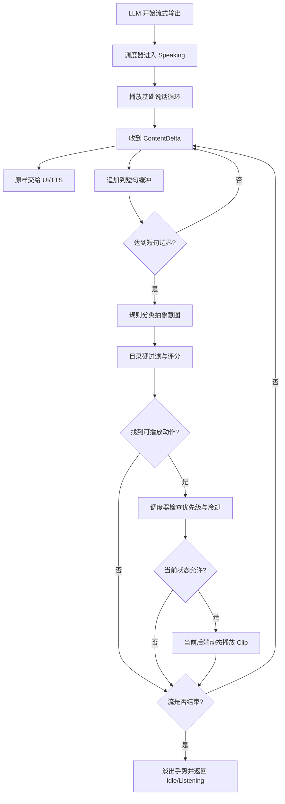
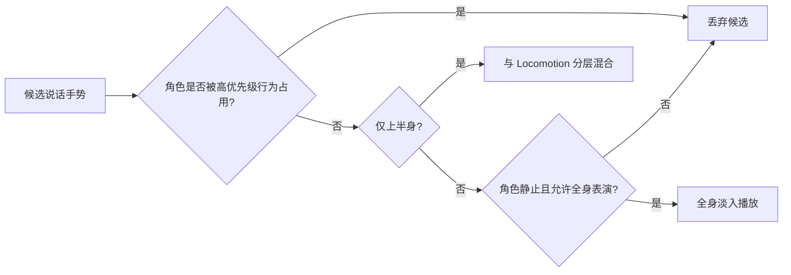

# NPC 流式对话肢体表现设计

> 状态：已确认；AnimGraph 上半身 MVP 已落地  
> 日期：2026-09-21  
> 决策：见 `Docs/decisions/ADR-024-local-streaming-performance-and-dynamic-gesture-slots.md`

## 1. 需求分析

NPC 在模型流式输出台词期间需要同步做自然的肢体动作，并满足以下约束：

1. 动作必须在回复尚未输出完时开始，不能等完整回复结束后才播放。
2. 具体动画名称和完整动作目录不进入系统提示词、工具 schema、聊天历史或压缩摘要。
3. 动作库可以持续增加，不因动画数量增长而增加 LLM 上下文。
4. 首期支持团结 AnimGraph 1.0.0；Animator 顶层 PlayableGraph 方案已确认但延后实现。
5. 说话手势不能随意打断移动、战斗、受击或剧情动作。
6. 点头、摊手、解释手势等纯表现动作不应产生 Agent 工具调用；移动、攻击、递交物品等改变游戏状态的动作仍由现有 `[AgentAction]` 执行。
7. 表现系统失效时只能损失动画效果，不能阻塞、修改或丢失 NPC 台词。

### 1.1 成功标准

- 流式回复开始后，NPC 立即进入说话基础姿态；首个完整短句到达后可以切换成与语义匹配的手势。
- 模型请求中不包含 `AnimationClip` 名称、状态机状态表或动作目录。
- 新增动作只需登记本地元数据与动画资源，不修改 NPC 提示词。
- 同一动作在冷却期内不会连续重复；没有合适动作时保持基础说话姿态。
- 上半身手势不影响正常移动；战斗、受击和确定性剧情动作具有更高优先级。
- AnimGraph 动态动作不要求进入状态机，使用包内 Slot 能力播放。
- Animator 动态动作不要求为每个 Clip 创建状态，使用一个顶层 Playable 合成器播放。
- 玩家打断、Agent 取消、宿主失活或角色死亡时，当前说话动作能安全淡出并释放运行态。

## 2. 核心决策

采用“本地表演导演”旁路：主 LLM 只输出台词；运行时监听相同的流式文本，将其切成短句、识别抽象表达意图、从本地目录选择动作，再交给当前动画后端播放。

```text
LLMStreamChunk
├─→ 对话 UI / TTS                      原有输出路径
└─→ NpcSpeechPerformanceController     新增旁路
      → ClauseSegmenter                短句切分
      → IGestureIntentClassifier       抽象意图
      → GestureResolver                本地动作检索
      → GestureScheduler               优先级、冷却、打断
      → INpcGestureDriver
          ├─ AnimGraphGestureDriver    SlotManager.PlayClip
          └─ AnimatorGestureDriver     顶层 Playable 混合
```

这条路径不注册 `[AgentTool]` 或 `[AgentAction]`，选择结果不写回消息历史。动作目录大小因此与上下文 token 完全解耦。

## 3. 职责边界

### 3.1 三类动作

| 类型 | 示例 | 决策方 | 执行路径 | 是否进入上下文 |
| --- | --- | --- | --- | --- |
| 说话微动作 | 点头、摊手、轻微摇头、思考、强调 | 本地表演导演 | `INpcGestureDriver` | 否 |
| 表意但无玩法结果 | 强烈拒绝、指示大致方向、戒备后仰 | 本地表演导演；受游戏状态约束 | `INpcGestureDriver` | 否 |
| 改变游戏状态的行为 | 移动、攻击、坐下、递交物品、开门 | 主模型或游戏逻辑 | 现有 `[AgentAction]` | 是 |

判断标准不是“动作看起来大不大”，而是动作是否改变权威游戏状态。表演导演只能写动画表现层，不得直接修改导航、战斗、背包、任务或场景状态。

### 3.2 与现有动画工具的关系

现有 `AgentAnimationTools` 保留，用于模型明确发起的剧情动作和诊断；它仍通过 `IAgentAnimationDriver` 操作状态机。新增说话表现不复用这些工具，原因是工具调用必须等参数组装完成、产生上下文记录，还会触发动作门控，不适合高频流式手势。

新增 `INpcGestureDriver` 与现有 `IAgentAnimationDriver` 并列：前者接收 `AnimationClip` 和表现参数，后者继续接收状态名与参数名。一个后端组件可以同时实现两个接口，但接口语义不合并。

## 4. 组件设计

### 4.1 `NpcSpeechPerformanceController`

挂在 NPC 宿主层级，订阅该 NPC 自己的流式输出，不使用全局静态事件。

职责：

- 在流式开始时进入 Speaking，并请求基础说话循环。
- 将 `ContentDelta` 同时交给原有 UI/TTS 和 `ClauseSegmenter`；表现旁路不得截断或改写正文。
- 收到短句后创建 `GestureIntentContext`，交给分类器与解析器。
- 在流式完成、取消、宿主失活或角色状态禁止表演时通知调度器收尾。
- 所有 Unity 动画调用回到主线程执行。

它不负责保存对话，不持有 LLM Session，也不改变消息拼接逻辑。

### 4.2 `ClauseSegmenter`

按以下条件从增量文本中提交短句：

1. 遇到 `，。！？；` 等明确边界。
2. 缓冲字符数达到上限，默认 20 个字符。
3. 流暂停超过短句等待上限，默认 350ms。
4. 流结束时提交剩余文本。

边界参数属于性能配置，不进入 NPC 提示词。系统不逐 token 判断动作，避免短文本语义不足导致姿态抖动。

### 4.3 `IGestureIntentClassifier`

首期只实现确定性规则分类器，输入短句和当前运行态，输出抽象意图：

```csharp
public enum EGestureIntent
{
    None,
    NeutralTalk,
    Explain,
    Emphasize,
    Agree,
    Reject,
    Question,
    Think,
    Welcome,
    Indicate,
    Warn,
    AngryTalk
}

public readonly struct GestureIntent
{
    public EGestureIntent Type { get; }
    public float Intensity { get; }
}
```

规则综合：短句关键词、问号/感叹号、NPC 当前情绪、好感等级和游戏状态。它不读取完整历史，也不向主 LLM追问。

> **落地订正（首期实现）**：分类器签名是 `Classify(string clause, ENpcEmotion emotion)` 而不是 §6.3 伪代码里的 `BuildContext()` —— 好感等级与游戏状态**首期没接**，等 `GestureResolver` 需要它们时再引入上下文对象，不提前铺一个只有一个字段的结构体。情绪侧也只用了 `Angry → AngryTalk` 一条映射，其余情绪的口味交给目录的 `Emotions` 字段去过滤。切分器与分类器落在 `Runtime/Agent/Npc/GestureClauseSegmenter.cs`、`RuleGestureIntentClassifier.cs`、`GestureIntent.cs`。

只有当规则表现经过实测仍明显不足时，才增加可选的小模型分类器。小模型同样只返回抽象意图，不接触动作目录；失败或超时立即回退规则结果，不能阻塞正文流。

### 4.4 `NpcGestureCatalog_SO`

动作目录是本地 ScriptableObject。每条记录至少包含：

```csharp
[Serializable]
public sealed class GestureDefinition
{
    public string Id;
    public AnimationClip Clip;
    public EGestureIntent[] Intents;
    public ENpcEmotion[] Emotions;
    public float MinIntensity;
    public float MaxIntensity;
    public float SelectionWeight;
    public float CooldownSeconds;
    public bool UpperBodyOnly;
    public bool Additive;
}
```

要求：

- `Id` 仅用于日志和测试，不提供给模型。
- 说话动作默认 `UpperBodyOnly=true` 且不包含 Root Motion。
- Generic/Humanoid、Avatar 和骨骼兼容性在资源导入或目录校验时检查，不在播放失败后猜测。
- 首期使用直接 `AnimationClip` 引用。只有动作包的实际常驻内存成为问题时，才在目录资源边界接入 YooAsset 延迟加载，不提前增加资源句柄系统。

### 4.5 `NpcPerformanceProfile_SO`

表现配置与角色文本人格分离，允许多个 NPC 复用同一套动作风格：

```csharp
public sealed class NpcPerformanceProfile_SO : ScriptableObject
{
    public NpcGestureCatalog_SO GestureCatalog;
    public AnimationClip SpeakingLoop;
    public int MaxClauseCharacters;
    public float ClausePauseSeconds;
    public float GestureFrequency;
    public float MinimumGestureInterval;
    public int MaxGesturesPerTurn;
    public float BlendInSeconds;
    public float BlendOutSeconds;
    public float PlaybackSpeed;
}
```

`NpcAgentProfile_SO` 只保存对该配置的引用。数值影响本地选择概率和节奏，不拼入系统提示词。

### 4.6 `GestureResolver`

首期先做硬过滤，再从合格项里选权重最高者：

```text
候选动作
  → 意图匹配
  → 情绪与强度范围
  → 仅上半身、非 Additive
  → 冷却与最近使用过滤
  → 配置权重 - 最近使用惩罚
  → 最高分动作
```

当前评分口径：

```text
score = definitionWeight - recentUsePenalty
```

没有合格候选时返回空，不强行播放错误动作。

### 4.7 首期调度逻辑

首期不单建 `GestureScheduler`；以下逻辑由 `NpcSpeechPerformanceController` 直接承担：

- Speaking 开始时立即播放基础说话循环，因此第一句尚未形成时角色也不会僵住。
- 同一时间只允许一个语义手势占用 `NpcGesture` 槽。
- 手势间隔、动作自身冷却和单次回复最大手势数均有硬限制。
- 玩法侧可用 `SetSuppressed(true)` 让战斗、受击、死亡或过场立即打断说话手势。
- 玩家新输入打断当前生成时，当前手势按配置淡出，不等待 Clip 结束。
- 动画后端失败时记录一次诊断并回退基础姿态，不影响文本输出。

建议优先级：

```text
死亡/受击/强制剧情 > 战斗/导航 > 显式 AgentAction > 说话语义手势 > 基础说话循环 > Idle
```

## 5. 动画后端设计

### 5.1 统一接口

```csharp
public interface INpcGestureDriver
{
    bool IsGesturePlaying { get; }

    bool TryPlayGesture(
        AnimationClip clip,
        float blendInSeconds,
        float blendOutSeconds,
        float speed,
        bool upperBodyOnly,
        bool additive,
        bool loop,
        out string error);

    void StopGesture(float blendOutSeconds);
}
```

驱动只接受解析后的 `AnimationClip`，不查目录、不做语义判断。返回失败原因供本地诊断，不回填 LLM 上下文。

### 5.2 AnimGraph 后端

项目安装的 `cn.tuanjie.animgraph@1.0.0` 已提供：

- `AnimSlotNode`：在现有 AnimGraph 内建立动态 Slot。
- `AnimGraphManager.slotManager`：公开的 Slot 管理器。
- `SlotManager.PlayClip(AnimationClip, slotName, ...)`：在同一张 PlayableGraph 中动态创建并混合 `AnimationClipPlayable`。
- `Stop` / `StopAllSlots`：停止并淡出 Slot。
- `PlayClipLine`：将来需要多段表演与事件时的唯一扩展点，首期不用。

推荐图结构：

```text
基础状态机/Locomotion ───────────────┐
                                      ├─ Layer Mixer ─→ Output
NpcGesture AnimSlotNode ─ AvatarMask ─┘
```

`NpcGesture` Slot 只承载动态说话 Clip；上半身 AvatarMask 保留腿部 Locomotion。首期驱动明确拒绝全身与 Additive 动作；Generic Rig 同样延后。

AnimGraph 驱动调用：

```csharp
manager.slotManager.PlayClip(
    clip,
    "NpcGesture",
    blendInDuration,
    blendOutEnabled: true,
    blendOutDuration,
    speedMultiplier,
    footIK: false);
```

不得创建第二张独立 `PlayableGraph` 输出到同一角色。AnimGraph 已经拥有自己的图和动画输出；外挂另一张图会产生多个系统竞争骨骼写入，而且不同 `PlayableGraph` 的节点不能直接连接。

### 5.3 Animator 后端

Animator 的长期方案是由一张顶层 `PlayableGraph` 统一拥有该 `Animator` 的输出：

```text
AnimatorControllerPlayable ── input 0 ─┐
                                       ├─ AnimationLayerMixerPlayable ─→ Animator
AnimationClipPlayable ─ input 1 + Mask ┘
```

- `AnimatorControllerPlayable` 包装角色原有 `RuntimeAnimatorController`，继续负责 Locomotion、战斗状态机和参数。
- `AnimationLayerMixerPlayable` 输入 0 始终为基础 Controller，输入 1 为当前动态 Gesture Clip。
- 输入 1 使用上半身 `AvatarMask`，权重由调度器在淡入淡出期间驱动。
- 切换 Gesture 时只替换输入 1 的 Clip Playable；首期按动作创建/销毁，不做对象池，只有分析器证明分配有问题时再优化。
- 顶层图是该 Animator 的唯一 `AnimationPlayableOutput`。不得让 Animator 自身 Controller 与另一张独立图同时争用输出。

现有 `AgentAnimatorDriver` 对状态、参数与速度的操作需要转发给同一图中的 `AnimatorControllerPlayable`，不能绕过顶层图继续假设 Animator 自己在独立求值。显式 `AgentAnimationTools` 的外部契约保持不变。

Unity 2022.3 的 `AnimationPlayableOutput` 用于把 PlayableGraph 连接到 Animator；`AnimationLayerMixerPlayable` 支持给指定输入层设置 `AvatarMask`：

- https://docs.unity3d.com/cn/2022.3/ScriptReference/Animations.AnimationPlayableOutput.html
- https://docs.unity3d.com/cn/2021.1/ScriptReference/Animations.AnimationLayerMixerPlayable.html

### 5.4 不采用 AnimatorOverrideController 作为正式后端

一个 `DynamicGestureSlot` 占位状态配合 `AnimatorOverrideController` 可以快速验证，但每次覆盖 Clip 都会重新分配动画绑定。它适合低频换装或武器动作，不适合说话期间连续更换手势。Unity 官方同样提示逐项覆盖会触发 binding reallocation：

- https://docs.unity3d.com/cn/2021.3/ScriptReference/AnimatorOverrideController.html

因此它只允许作为独立原型，不进入正式接口实现。

## 6. 关键流程

### 6.1 流式语义手势



### 6.2 动作冲突



### 6.3 伪代码

```csharp
public void OnStreamChunk(LLMStreamChunk chunk)
{
    speechPresenter.Append(chunk.ContentDelta);
    clauseSegmenter.Append(chunk.ContentDelta);

    while (clauseSegmenter.TryTakeClause(out string clause))
    {
        GestureIntent intent = intentClassifier.Classify(clause, BuildContext());
        GestureDefinition gesture = resolver.Resolve(intent, BuildContext());

        if (gesture != null)
            scheduler.TrySchedule(gesture);
    }

    if (chunk.IsDone)
        scheduler.EndSpeaking();
}
```

## 7. 数据与生命周期

### 7.1 静态资产

```text
NpcAgentProfile_SO
└─ NpcPerformanceProfile_SO
   ├─ 节奏与表现强度
   └─ NpcGestureCatalog_SO
      └─ GestureDefinition[] → AnimationClip
```

### 7.2 每实例运行态

```text
NpcSpeechPerformanceController
├─ 当前流 generation
├─ 短句缓冲
├─ Speaking 状态
├─ 最近动作与冷却表
├─ 当前动作占用
└─ 本轮已播手势计数
```

运行态不持久化。切场景、角色销毁或会话重建时直接清空；动作历史不属于 NPC 长期记忆。

## 8. 中断与失败处理

| 情况 | 行为 |
| --- | --- |
| 流被玩家新输入打断 | 丢弃未完成短句，当前手势淡出 |
| 无目录或无驱动 | 继续显示台词，只记录一次本地诊断 |
| 无匹配动作 | 保持基础说话循环 |
| Clip 与 Avatar 不兼容 | 拒绝播放并将该目录项标记为本实例不可用 |
| 角色开始移动 | 上半身手势可继续，全身手势淡出 |
| 进入战斗、受击、死亡或过场 | 立即让位给高优先级系统 |
| 后端播放失败 | 不重试同一动作；下一短句重新解析 |
| 可选分类器超时 | 使用规则分类结果，不阻塞流式正文 |

## 9. 可观测性

首期仅在后端播放失败时记录一次本地警告，且不写进对话历史。结构化决策日志与开发面板不在首期实现；只有实际排查动作命中问题时再增加。

## 10. 测试设计

### 10.1 编辑器单元测试

- 短句切分覆盖中文标点、跨 chunk 标点、超长无标点文本、结束残留和取消。
- 固定 seed 下 Resolver 结果可重复。
- 冷却动作不会连续选中。
- 移动、手部占用和战斗约束能过滤不兼容动作。
- 没有候选或驱动失败时正文流仍完整到达输出方。
- 语义手势不产生工具调用，不进入历史消息和压缩输入。

### 10.2 PlayMode 测试

- AnimGraph 的 `NpcGesture` Slot 能动态播放未进入状态机的 Clip，并在结束后回到基础动作。
- Animator 顶层 Playable 能保持原 Controller 参数与状态迁移，同时混合上半身 Gesture。
- 角色移动时腿部姿态不被上半身手势覆盖。
- 中断时权重在指定时间内回到 0，没有残留输入或无效 Playable。
- 连续播放不同 Humanoid Clip 不出现绑定错误、骨骼跳变或 Root Motion 位移。

### 10.3 性能验收

- 典型 NPC 同屏数量下，短句分类和 Resolver 不产生持续 GC 峰值。
- 单次手势切换不出现可感知主线程尖峰。
- 动作目录扩大时只影响本地检索与资源内存，不改变 LLM 请求 token。

性能阈值应在首个真实场景建立基线后填写，不在设计阶段虚构数字。

## 11. 分阶段落地

1. **已完成**：建立旁路、短句切分、规则分类、目录、Resolver 和控制器内调度；测试确认没有 `[AgentTool]` / `[AgentAction]`。
2. **已完成**：接入 AnimGraph `NpcGesture` Slot，只支持上半身、非 Additive 动作。
3. **待真实角色调参**：配置目录、基础说话循环、冷却，并由玩法状态调用 `SetSuppressed`。
4. **延后**：接 Animator 顶层 Playable，并让现有 Animator 驱动委托给 `AnimatorControllerPlayable`。
5. 只有规则分类实测不足时才评估小模型分类器；只有资源常驻成为问题时才接 YooAsset 延迟加载。

## 12. 非目标

| 不做 | 拒绝原因 | 将来的唯一落点 |
| --- | --- | --- |
| 把完整动作列表注入系统提示词 | token 随资源增长，污染角色认知与缓存前缀 | 不增加；目录始终留在本地 Resolver |
| 每个说话手势走 Agent 工具调用 | 延迟高、产生历史记录、动作组装完成前不能执行 | 仅改变游戏状态的行为继续走 `[AgentAction]` |
| 在台词中输出隐藏动作标签 | 标签可能泄漏，破坏 NPC 纯台词契约 | 若未来 Provider 有独立结构化 side channel，只接入分类器输入边界 |
| 给 AnimGraph 再挂独立 PlayableGraph | 与现有输出竞争，同图节点也不能跨图连接 | 只使用 AnimGraph 自带 Slot |
| 为每个 Clip 创建 Animator/AnimGraph 状态 | 状态机随动作库膨胀，维护和热更新成本高 | 状态机只保留玩法状态；表现 Clip 走动态槽 |
| 首期使用 AnimatorOverrideController 正式播放高频手势 | 高频替换会重分配动画绑定 | 仅允许原型；正式后端使用顶层 Playable |
| 自动生成动画、动作重定向或 Motion Matching | 与流式调度是独立问题，会扩大首期范围 | 将来只替换 `GestureResolver` 或资源生产线 |
| 口型、面部表情与眼神 IK | 时间基准和骨骼通道不同 | 独立 Facial/Gaze Driver，复用同一 Speech 生命周期 |
| 跨 NPC 编舞和双人交互 | 需要共享时间线、空间对齐和资源锁 | 独立剧情编排系统，不进入说话微动作调度器 |

## 13. 已确认决策

1. Animator 后端接受由顶层 PlayableGraph 接管输出，不使用 `AnimatorOverrideController` 作为正式方案；本轮延后实现。
2. 首期只支持上半身 Humanoid、非 Additive 说话动作；Generic Rig 与全身表意动作延后。
3. UI 纯文本场景不人为延迟显示；基础说话循环从首个文本增量立即播放，语义手势从短句边界开始。若后续接 TTS，再用音频时间轴替代文本到达时间。
